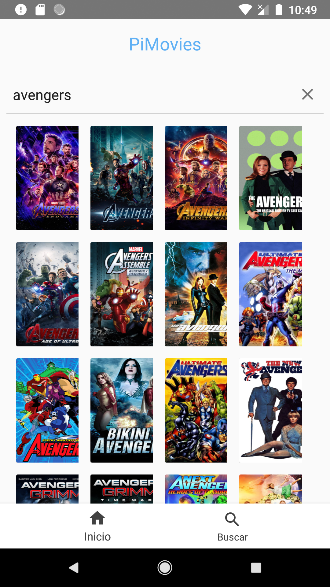

# PiMovies

Aplicación Android para buscar información de películas y programas de televisón 





## Dependencias

+ OkHttp   https://square.github.io/okhttp/
+ Glide   https://github.com/bumptech/glide
+ Gson    https://github.com/google/gson
+ Android youtube player https://github.com/firozanawar/Android-YouTube-Player


## Preguntas


Las capas de la aplicación (por ejemplo capa de persistencia, vistas, red, negocio, etc) y qué clases pertenecen a cual.


```
Model Vista Presentador se usa en el proyecto, para delegar la logica a un interactor, un presentador es el puente entre el interactor y la vista, se trabaja con fragmentos sobre una sola actividad principal, se traen los datos del api mediante un cliente http y se deszerializan para inyectarlos en un adapator y finalmente a una vista.

```

 La responsabilidad de cada clase creada.

 ```
 MVP -> Logica de negocio, Interprete y Vista de datos

 DATA -> Modelos para la deszerialización de los datos

 SERVICES -> Servicio cliente http para traer los datos del api

```

En qué consiste el principio de responsabilidad única? Cuál es su propósito?

```
  Un componente, módulo o clase encargado de una sola funcionalidad, este debe ser un componente funcional que responde a un cambio o acción determinada.  
```


 Qué características tiene, según su opinión, un “buen” código o código limpio?

 ```
  Un Código limpio es aquel que es legible y entendible sin necesidad de recurir de primera mano a la documentación, la legibiidad depende de la estructura del proyecto su dipoisición de carpeta o paquetes, asi como la nomenclatura y semántica, posear archivos de configuración y separar en componentes, providers o clases funcionales hacen el código más limpio, y hace que el agregar nuevas caracterísicas sea un proceso eficiente.
```